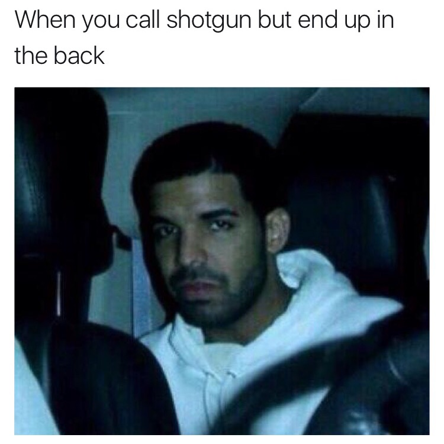

# meme-maker

The goal of this project is to create the basic Twitter-screenshot style meme given a text and an image. 

## Motivation

What I like to call the "Twitter-screenshot meme" is a meme format that was invented by taking a screenshot of a tweet containing text with an image attachment. This format is very popular on Instagram, Facebook and Twitter. 

I would format this way by doing the following:

1. Open Twitter on my phone
2. Compose a new Tweet and attach an image
3. Post the Tweet
4. Take a screenshot of the Tweet
5. Crop the screenshot to a square

I was able to go through these steps in about 45 seconds when I had a string of text and image ready.

Normally, I would want to create about 7-9 of these memes for each account at the beginning of the week, and then post once or twice a day throughout the week. I had 5 accounts so this would take me around 30 minutes a week *just doing the mechanical work of steps 1-5*. This does not count the time I spent finding the content of the memes, i.e. the text and image, which takes much longer. 

After coding up two other projects, one to help me [partition an image](https://github.com/evmarts/meme-cropper) of a meme and another to [apply optical character recognition](https://github.com/evmarts/meme-text-ocr) on images of text, I was decided 30 minutes a week was too much.


## Getting Started

Clone:
```git clone https://github.com/evmarts/meme-maker.git```

Run the script:
```python meme-maker.py```

### Prerequisites

- Python

## Built With

* Python Imaging Library (PIL)

## Examples

Suppose we have a string of text, an image and we would like to make a meme out of them:

```
When you call shotgun but end up in the back
```


Once the image is stored in the  ```in/``` directory, we can run the Python script: 

~~~
$ python meme-maker.py
path of image to use: in/img.jpg
enter a caption: when you call shotgun but end up in the back
saved image as: meme.png
~~~

and the image *meme.jpg* will be stored in the ```out/``` directory:




## Authors

* Evan James Martin
