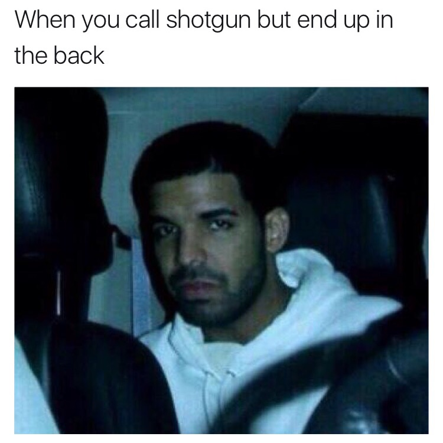

# meme-maker
Takes text and an image and creates a meme.

### Motivation:

Memes found on Instagram typically look like the following:

Usually these memes are created by tweeting the text accompanied by the image to Twitter and then cropping the screencap of the post. 

This is an unnecessary amount of work for a simple task, especially if one is creating these memes in batches. 

### meme-maker.py

Prompts user for .txt file and .jpg file:

~~~
$ python meme-maker.py
text file to use: sample_text.txt
image to use: sample_pic.jpg
~~~

Saves the meme:

~~~
saved meme as: meme.jpg
~~~

