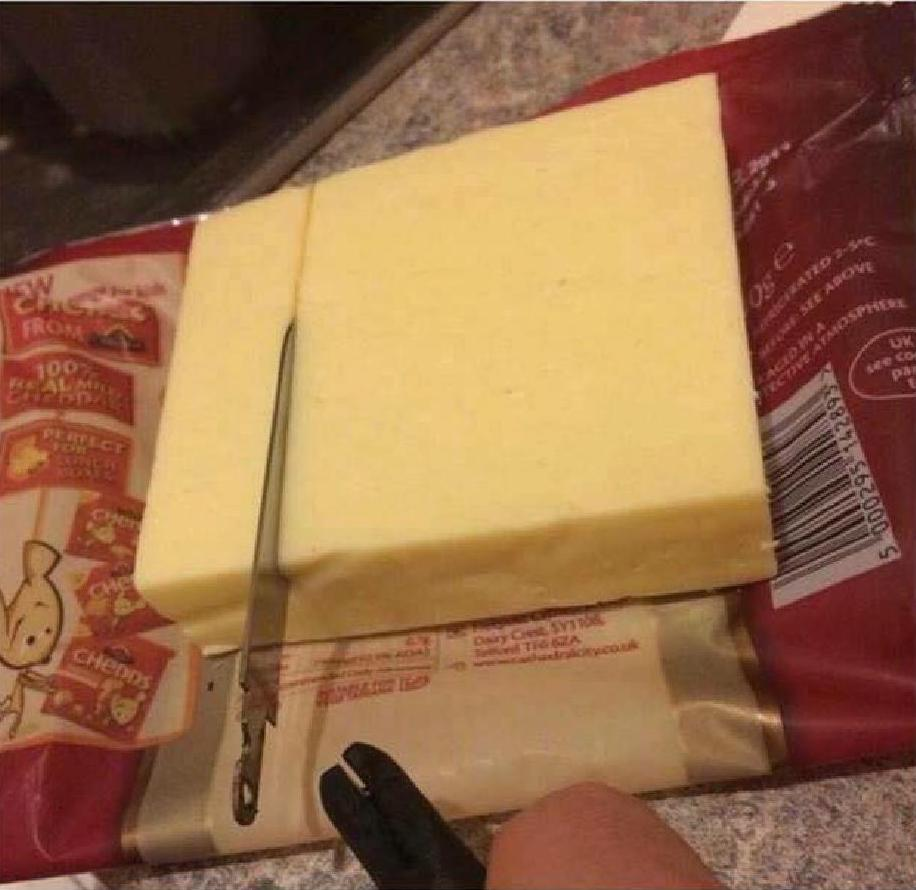

# meme-maker
Takes text and an image and creates a meme.

### Motivation:

Memes found on Instagram typically look like the following:

Usually these memes are created by tweeting the text accompanied by the image to Twitter and then cropping the screencap of the post. 

This is an unnecessary amount of work for a simple task, especially if one is creating these memes in batches. 

### meme-maker.py

Prompts user for an image file and a caption:

~~~
$ python meme-maker.py
path of image to use: in/img.jpg
~~~

 img.jpg

~~~
enter a caption: when you call shotgun but end up in the back
~~~

Saves the meme as an image:

~~~
saved image as: meme.png
~~~

 meme.png

